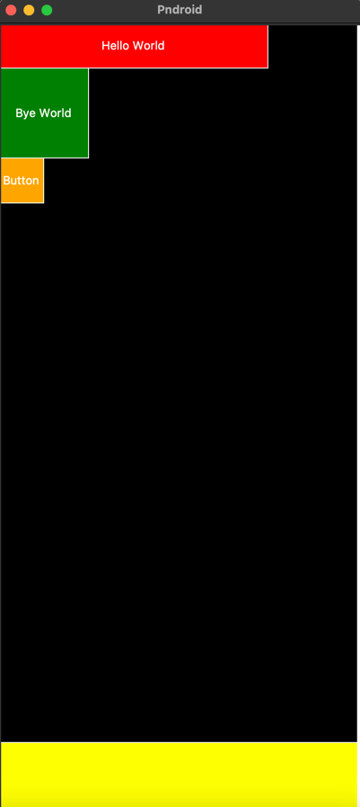

# Pndroid

## Introduction

What is Pndroid? Pndroid is an experimental program designed to demonstrate the Android native UI measurement process.

## What does Pndroid do?

1. Simulated the VSync signal source.  
2. Implemented a basic view hierarchy including View, ViewGroup, LinearLayout, TextView, and Button.  
3. Established simplified measure, layout, and draw processes driven by VSync.  
4. Achieved visualization of layout results using tkinter.  
5. Supports UI customization compatible with Android XML layout files.

## How to use?

Run the following command in your terminal:

```bash
export PYTHONPATH=.:$PYTHONPATH
python3 app.py
```

And you'll see:



Additionally, you can modify the UI by editing `main_activity.xml` in the root directory.
